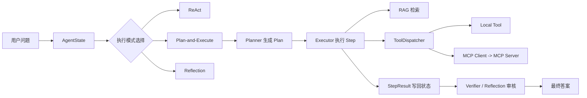

# MindPilot

MindPilot 是一个基于 Spring Boot + Spring AI 的 AI Agent 多模式智能体协作平台。项目目标不是只做一个聊天框，而是把用户问题变成可追踪的任务执行流：自动选择 ReAct、Plan-and-Execute 或 Reflection 模式，结合工具调用、MCP 远程工具、长期记忆和 RAG 知识库完成回答。

## 项目亮点

- **多模式 Agent 执行**：支持 ReAct、Plan-and-Execute、Reflection 三种执行模式，复杂问题会拆成结构化 `Plan`，每一步生成 `StepResult` 并写回 `AgentState`。
- **中心调度器 + 专家 Agent 协作**：通过 Planner、Executor、Verifier 和专家路由把复杂任务拆成规划、检索、工具调用、结果审核等子流程。
- **工具调用体系**：实现 `ToolRegistry` 工具注册中心和 `ToolDispatcher` 工具分发器，统一管理本地 Java 工具与 MCP 远程工具，支持 schema 暴露、参数校验、超时、重试和执行日志。
- **MCP 适配**：内置 RAG/Memory MCP Server，支持 `initialize`、`tools/list`、`tools/call`；同时提供 MCP Client 适配器，可以把远程 MCP 工具注册到平台工具体系中。
- **Mem0 风格记忆**：实现会话滑动窗口、摘要压缩、长期记忆抽取、实体事实更新和记忆召回，长期记忆也可以作为 MCP 工具写入。
- **RAG 检索增强**：支持 Markdown 解析、结构化切分、上下文索引、向量检索、Elasticsearch BM25 粗排、RRF 混合召回、Cross-Encoder rerank 精排，以及 LLM 结构化 Query Rewrite、意图识别和关键词抽取。
- **演示友好**：提供 Docker Compose、轻量本地 Demo、接口级 MCP 验证脚本和 workflow trace 导出脚本，方便面试或给 HR/面试官快速看代码。

## 一句话业务流程

用户发起问题后，后端创建 `AgentState`，读取短期记忆、长期记忆和可用工具列表；系统根据任务复杂度选择执行模式，复杂任务会生成 `Plan`，Executor 按步骤调用 RAG、ToolDispatcher 或 MCP Client，每一步产出 `StepResult`，最后基于状态、证据和反思审核生成答案。

## HR 快速看点

- **后端工程能力**：Spring Boot 分层架构、MyBatis、PostgreSQL + pgvector、Elasticsearch、SSE、Docker Compose。
- **AI 工程能力**：Spring AI 接入、Agent Loop、结构化规划、工具调用、MCP 协议适配、RAG 检索增强、记忆管理。
- **可验证代码**：不是只写在简历上，仓库里有可运行接口、工具 schema、MCP server 返回、工作流状态对象和测试用例。
- **面试可讲闭环**：能从“用户请求进来”一路讲到“规划、检索、工具调用、记忆召回、结果审核、状态持久化”。

## 技术栈

- **后端**：Spring Boot 3.5、Spring AI 1.1、MyBatis、PostgreSQL、pgvector
- **前端**：React 19、Vite、Ant Design
- **AI/RAG**：DeepSeek / ZhipuAI、Ollama bge-m3 embedding、Elasticsearch BM25、Cross-Encoder rerank
- **工程化**：Docker、Docker Compose、Nginx、SSE、MCP JSON-RPC 风格接口

## 代码入口

- **Agent 主流程**：`mindpilot/src/main/java/.../agent`
- **结构化状态对象**：`mindpilot/src/main/java/.../model/workflow`
- **工具注册与分发**：`mindpilot/src/main/java/.../service/ToolRegistry.java`、`mindpilot/src/main/java/.../service/ToolDispatcher.java`
- **MCP Server**：`mindpilot/src/main/java/.../controller/RagMcpServerController.java`
- **RAG 检索链路**：`mindpilot/src/main/java/.../service/impl/HybridSearchServiceImpl.java`
- **记忆模块**：`mindpilot/src/main/java/.../service/impl/MemoryServiceImpl.java`
- **前端页面**：`ui/src/components`
